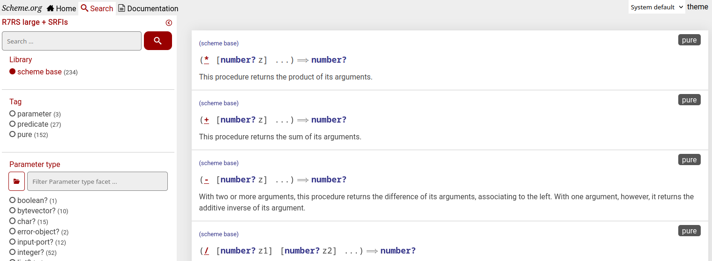

= Scheme index
:toc: left

https://index.scheme.org[Scheme index] is a tool for indexing and searching through procedures, syntax, values from scheme specifications and SRFI libraries.



== Userguide

=== Control pane

In the control pane, optionally select values from the filter list, optionally enter search query in the text field, and press either enter or button with magnifying glass to display the results. You can use control + / to quickly focus to the query text field.

=== Result list

Each result item is either a procedure, a macro, or a value. At the top it shows a library it is exported from. Identifiers that are exported from multiple libraries will appear in the result list multiple times. The library name can be clicked, which will result in starting new search using said library as a filter. On the right side top, associated list of tags with the result is shown. Tags are also clickable, and start a search using the clicked tag as a filter.

Procedures and value names are rendered in *red*. Procedures are distinguished by being surrounded with parenthesis, as if being called. Following the name until the "=>" sign are parameters. If parameter is just a name, it means it has an unspecified type. Otherwise, parameter may be a list of type and name. Types are usually represented as predicate procedures (sometimes a type may be opaque or logical, and without a disjoint predicate function to distinguish it). `#f` literal can appear as a type due to its commonplace use to signify lack of a value. Type can also be a logical "or" of multiple types, separated by `/`. 

After the `=>` sign is the return type. The return type is same as parameter type, and additionally may contain: 

* a `*` symbol (meaning it returns a value of unknown but usable type); 

* a list with "values" word in car position (meaning it has a multivalue return); 

Types expressed as predicates in *blue* are links. Pressing on a type in parameter position will search using that type as *return value* filter; pressing on a type in return value position will search using that type as *parameter* filter.

If one of parameters or return value is *procedure?*, *list?*, *vector?*, its signature might be further elaborated below the main procedure's signature.

Macros are rendered in *green*. If macro is complex, some parts of it are grouped, and the syntax of those groups shown below the syntax of whole macro. Macro literals are also rendered in green.

=== Tags

Result items might have one or more of following tags

* pure - this procedure is referentially transparent (as long as whatever procedure parameters it has are also referentially transparent). Procedures that return undefined value cannot be marked as pure;
* predicate - this procedure that takes any object and returns a boolean. Such procedure may be used as a type;
* deprecated - not recommended to be used, exists only for backwards compatibility with older SRFIs.

=== Filtering logic

Selecting multiple libraries, will return results that are part of *any* of the given libraries.

Selecting multiple tags, will return results that contain *all* of the given tags.

Selecting multiple parameter types will return results that match *all* of the given types. 

Selecting multiple return types will return results that match *all* of the given types. As and in case filter by parameter type, when filtering by return type the type hierarchy is taken into consideration. Searching by a "parent" return type will also yield procedures returning more precise "child" types.

The text query is parsed using https://solr.apache.org/guide/6_6/the-dismax-query-parser.html#the-dismax-query-parser[edismax parser], and is used to filter by name, description and parameter / subsyntax names. This means it supports and interprets common searching syntax, such as using "-" in front of the word to exclude results containing said word. This has its disadvantages; if you tried to search for coercion functions and typed `->string` into the search input field, you wouldn't find relevant results, because the leading minus was interpreted specially. Instead, you'd have to search using "exact phrase", by putting double quotes around the search.


== Obtaining and running index yourself

=== Download

Select prebuilt versions are available at https://github.com/arvyy/r7rs-index-site/releases

Docker image (always corresponding to latest deployed version) may be pulled from `arvyy/scheme-index:master`.

=== Building native

Build server by running `sbt clean assembly`. The output will be a jar file in `target/scala-*/scheme-index.jar`.

Build frontend by running `npm run build` in subfolder `client/frontend`. The output will be in `client/frontend/dist/frontend`.

Build CLI app by running `npm run build` in subfolder `client/cli`. The output will be in `client/cli/dist`.

Build documentation using `asciidoctor README.adoc`. The output will be `README.html`.

=== Running native

Once built, you'll need a webserver to serve static files and proxy to API.
The webserver should:

* proxy to api on `/rest` endpoints
* return static files on direct match
* return index.html for other paths.

To launch API backend, run `java -jar scheme-index.jar`

Note that working directory is important; type files, configuration are resolved relative to the working dir, not relative to jar file.

See <<Configuration>> section for configuring the application behavior.

=== Running docker image

Run locally built images using docker-compose

```
cd docker
mkdir logs
docker rmi docker-nginx:latest docker-app:latest scmindex-builder:latest -f
docker-compose -f docker-compose.local.yml up
```

To run deployed images from registry use

```
cd docker
mkdir logs
docker-compose up
```

== Configuration

=== configuration.scm

Core application behavior is managed using a scm configuration file, containing a list of key-value pairs, where each key is a symbol (ie. an alist).
Running the application, first argument is interpreted as a path to configuration file. If not set, it defaults to `./config/configuration.scm`

The following is exhaustive list of valid properties
[cols="1l,3,1l"]
|===
| Property
| Description
| Default

| solr-embed
| Specify whether embed solr / lucene index inside the application itself (if `#t`), or connect to a standalone solr instance (if `#f`)
| #t

| solr-home
| Directory contain solr home / configuration. Relevant only if solr-embed is #t
| "./solrhome"

| solr-url
| Solr url to connect to. Relevant only if solr-embed is `#f`
| "http://localhost:8983/solr"

| solr-core
| Solr core to use
| "scmindex"

| port
| Which port to use. Relevant only if enable-web is `#t`
| 8080

| db-path
| Path to DB file used by SQLite
| "db"

| spec-index
| Index of definitions to load (see Identifiers definitions section)
| "./types/index.scm"

| filterset-index 
| Index of filtersets to load (see Filterset definitions section)
| "filters/index.scm"
|===

=== Identifiers definitions

Identifiers definitions are grouped into files (one file for each library), and a single root index file which defines names and paths to those files.
The index file is specified in configuration under `spec-index` property, with a default value "./types/index.scm".

Index should be a list of pairs - where `car` is a symbolic library name, and `cdr` is associated information regarding definitions to load from. `cdr` may be an alist, with following fields:

* `'file` - path from where to load definitions.

* `'exclude` - a list of definitions to ignore from the file. 

Alternatively, `cdr` might be a string, in which case it's treated as a file path.

```
(
    ((scheme base) . "types/scheme.base.scm")
    ((scheme r5rs) . ((file . "types/r5rs.scm")
                      (exclude . (transcript-on transcript-off))))
)
```

Each definitions file is a list of entries, where each entry is an association list, using symbols as keys. Each entry either describes a group of identifiers, or a single identifier. 

Group has following properties:

[cols="1m,3a"]
|===
| key
| description

| group
| A list of identifiers under the group. Each entry must have format as described under a table for single idenfier entry.

| desc
| A textual description applicable for entire group
|===

Single identifier has following properties:

[cols="1m,3a"]
|===
| key 
| description

| name
| The name of the function / syntax / value. The name doesn't have to be unique - in particular with procedures, definition is repeated for all possible invocation overloads with different parameter counts. Required.

| signature
| S-expr defining signature. The format depends on a type (function / syntax / value) being described.

== Function

In case of function, the format is either `(lambda (<parameter> ...) <return type>)` or `(case-lambda ((<parameter> ...) <return type>) ...)`.

Each parameter is either of the form `(<type> param-name)` or just `param-name`, when type is "any". Each parameter may be succeeded by a `...` literal to indicate varargs / repetition.

Parameter type is either:

* a predicate name (eg. `list?`);

* a type union in the form of `(or <type> ...)` (eg. `(or list? number?)`). When using `or`, `#f` might be used as a type inside of it due to its common appearance as a "null" value.

Return type can be same as parameter type described above, plus:

* `undefined`, indicating a value that shouldn't be used in portable code (eg. result of `for-each`);

* `*`, indicating a useful value but of unknown type.

* `(values <type> ...)` form when the function returns more than one value.

== Syntax

In case of syntax, the format is `(syntax-rules (<keyword> ...) (<pattern> <optional-return-type>) ...)`

Pattern should be: symbol, `.`, `...`, or grouping of patterns inside `()`. If optional return type is provided, it describes
the resultant type when syntax is used as an expression. As a hatch to rendering outside of parens, use `(_append )` form, which concatenates its arguments.

== Value

In case of simple value, the format is `(value <type>)`

where type is same as described under functions.

| tags
| A list of symbols. Tags don't have inherent special treatment (ie., definition can make use of any tag it wants). 
Currently used tags are described in <<Tags>>

| subsigs
| Additional elaboration of signatures for the parameters / returns / syntax fragments / datastructure content. Each entry in this list is a list,
 where first element is a name (corresponding to parameter / syntax fragment / etc), and second parameter is its signature. The signature can be either 
one of as described in `signature` section, as well as additionally: 

* `(pattern <pattern> ...)` - describes subsyntax pattern, expanding template variables used in main signature of the syntax;

* `(alist <car> <cdr>)` - describes an alist datastrucutre, where `<car>` and `<cdr>` has same format as function parameter definition;

* `(list <element>)` - describes an list datastrucutre, where `<element>` has same format as function parameter definition;

* `(vector <element>)` - describes an list datastrucutre, where `<element>` has same format as function parameter definition;

| desc
| Textual description.

|===

=== Filterset definitions

Filterset is a coarse filter, and defines which libraries to include (and optionally how to rename them). Filterset definitions are structured into files one for each filterset option, and a single root index file which defines names and paths to those files.

The index file is specified in configuration under `filterset-index` property, with a default value "./filters/index.scm".

Index should be a list of alists. Each alist contains three fields:

* `code` - used in links;

* `name` - displayed text;

* `file` - associated filterset definition file.

Filterset definition file should be a list of pairs. `car` is a symbolic library name (matching what is defined in index for identifiers definitions). `cdr` is either a symbolic library name (in which case, all the usages of library in `car` are renamed to what is in `cdr`), or a `#t` value (indicating to include library in `car` as is, without a rename).

=== Logging

Scheme index uses logback for logging. By default (as defined in `src/main/resources/logback.xml`) it only does rolling file logging into `./logs` directory, and not into standard output.
You can provide custom logging configuration by running

```
java -Dlogback.configurationFile=/path/to/config.xml -jar scheme-index.jar
```

Consult https://logback.qos.ch/manual/configuration.html[Logback documentation] for details.

== REST API

Scheme index exposes following RESTful json API. The endpoints are tentatively stable; new properties might be added but existing properties are unlikely to be changed.

=== `/rest/filterset`

List of filtersets as strings. For all endpoints below, `{filterset name}` must correspond to one of the code here.

JSON schema
[source,json]
----
{
    "type": "array",
    "items": {
        "type": "object",
        "properties": {
            "code": {
                "type": "string"
            },
            "name": {
                "type": "string"
            }
        }
    }
}
----

'''

=== `/rest/filterset/{filterset name}/libs`

Libraries found in index as strings.

JSON schema
[source,json]
----
{
    "type": "array",
    "items": {
        "type": "string"
    }
}
----

'''

=== `/rest/filterset/{filterset name}/tags` 

Tags found in index as strings.

JSON schema
[source,json]
----
{
    "type": "array",
    "items": {
        "type": "string"
    }
}
----

'''

=== `/rest/filterset/{filterset name}/returns`

Types, which were used as a return type, found in index as strings.

JSON schema
[source,json]
----
{
    "type": "array",
    "items": {
        "type": "string"
    }
}
----

'''

=== `/rest/filterset/{filterset name}/params`

Types, which were used as a parameter type, found in index as strings.

JSON schema
[source,json]
----
{
    "type": "array",
    "items": {
        "type": "string"
    }
}
----

'''

=== `/rest/filterset/{filterset name}/search` 

Returns found identifiers and faceting meta data.

Query parameters

[cols="1l,3"]
|===
| query
| text search parameter. Query is parsed using edismax, and therefore some text tokens have special meaning

| start
| result offset (pagination).

| rows
| size of returned result list. Defaults to 40 if unspecified. 

| lib
| library filter. Possible values returned in `/rest/libs`. The parameter can appear multiple times, and the result will include procedures from any of given libraries.

| tag
| tag filter. Possible values returned in `/rest/tags`. The parameter can appear multiple times, and the result will include procedures which contain all given tags.

| param
| param type filter. Possible values returned in `/rest/params`. The parameter can appear multiple times, and the result will include procedures which contain all given parameter types.

| return
| return type filter. Possible values returned in `/rest/returns`. The parameter can appear multiple times, and the result will include procedures which contain all given return types.

| facet
| whether to return facet information of the query. Defaults to "true"
|===

JSON schema
[source,json]
----
include::searchresult.schema.json[]
----
